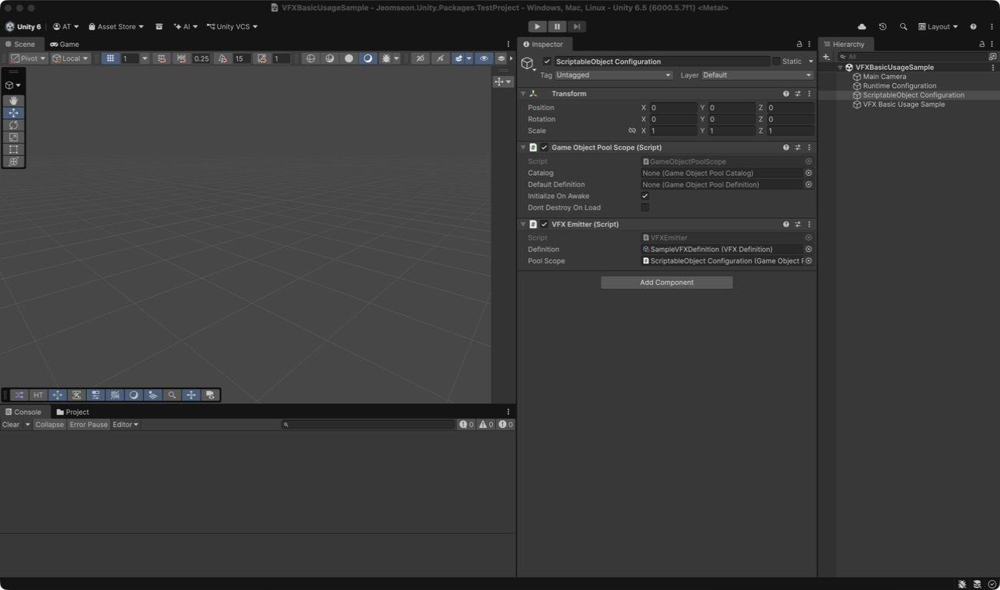

# Jeomseon Unity VFX

A Unity package that spawns ParticleSystem effects and automatically cleans them up or returns them to a pool.
It supports runtime code configuration and Inspector configuration through ScriptableObject assets.

## Requirements

- Unity 6000.6.0f1 or later
- `com.jeomseon.unity.game-object-pooling` 0.4.0 or newer (declared as a dependency in `package.json`)

## Install via OpenUPM

Register the OpenUPM scoped registry once in your project's `Packages/manifest.json`.

```json
{
  "scopedRegistries": [
    {
      "name": "OpenUPM",
      "url": "https://package.openupm.com",
      "scopes": [
        "com.jeomseon"
      ]
    }
  ],
  "dependencies": {
    "com.jeomseon.unity.vfx": "0.4.0"
  }
}
```

## Install via Git URL

Enter the following URL in Unity Package Manager's `Install package from git URL`.

```text
https://github.com/jeomseon0516/Unity.VFX.git#v0.4.0
```

## Main types

| Type | Responsibility |
| --- | --- |
| `VFXEmitter` | Initializes a configuration and spawns effects. |
| `VFXConfiguration` | Combines the prefab, pool, playback, and automatic-return rules in code. |
| `VFXDefinition` | Stores the same settings in an Inspector-editable ScriptableObject. |
| `VFXInstance` | Required component on the prefab root. Do not manipulate it directly. |
| `VFXHandle` | Safe handle for releasing, pausing, resuming, and moving a spawned effect. |
| `IVFXLifetimeConfiguration` | Creates per-spawn state that decides when an effect is returned. |

## Preparing a prefab

1. Add `VFXInstance` to the root GameObject of the effect prefab.
2. Place `ParticleSystem`, `TrailRenderer`, `Animator`, and other effect components below it.
3. Put custom components that require reset on the prefab **root** and implement GameObjectPooling's
   `IPoolGetHandler` or `IPoolReleaseHandler`. The pool does not scan child objects for these handlers.

Configuration creation or the first spawn throws when the prefab root has no `VFXInstance`.

## Using a pool from code

```csharp
using Jeomseon.Unity.GameObjectPooling.Configurations;
using Jeomseon.Unity.GameObjectPooling.Registrations;
using Jeomseon.Unity.GameObjectPooling.Scopes;
using Jeomseon.Unity.VFX;
using UnityEngine;

public sealed class HitVFXSpawner : MonoBehaviour
{
    [SerializeField] private VFXEmitter emitter;
    [SerializeField] private GameObjectPoolScope poolScope;
    [SerializeField] private GameObject prefab;

    private void Awake()
    {
        var pool = new UnityGameObjectPoolConfiguration(prefab, prewarmCount: 4, maxInactiveCount: 16);
        var registration = new GameObjectPoolRegistration(
            pool,
            PoolLifetimeConfiguration.Scope,
            "Hit VFX");
        var configuration = VFXConfiguration.Pool(
            registration,
            ParticleCompletionVFXLifetimeConfiguration.Default);

        emitter.Initialize(configuration, poolScope);
    }

    public VFXHandle Spawn(Vector3 position) =>
        emitter.Spawn(position, Quaternion.identity);
}
```

A `PoolLifetimeConfiguration.Scope` pool is disposed with its `GameObjectPoolScope`. Use
`VFXConfiguration.Instantiate(prefab, lifetime)` to create a new instance each time without pooling. That path
destroys the instance when released.

## Configuring with ScriptableObjects

1. Create a `VFXDefinition` from **Assets > Create > Jeomseon > VFX > VFX Definition**.
2. Set `Reuse Mode` to `Pool`, then assign a `UnityGameObjectPoolDefinition` and a lifetime Definition.
3. Assign that Definition and a `GameObjectPoolScope` to the Scene's `VFXEmitter`.
4. Call `VFXEmitter.Spawn(...)` from another script. `Awake()` converts the Definition into a runtime configuration.

For a non-pooled effect, set `Reuse Mode` to `Instantiate` and assign `Prefab`. Create lifetime Definitions from
the `Manual`, `Timed`, or `Particle Completion` entries under **Jeomseon > VFX > Lifetime**.



Assign both `Definition` and `Pool Scope` as shown on the `ScriptableObject Configuration` object above.

## Choosing when to return an effect

| Configuration | Behavior | Best fit |
| --- | --- | --- |
| `ManualVFXLifetimeConfiguration` | Never returns automatically. | Persistent effects whose end is known by game logic |
| `TimedVFXLifetimeConfiguration` | Returns after a duration. | Fixed-duration effects independent of particle state |
| `ParticleCompletionVFXLifetimeConfiguration` | Returns after all included particles have died. | Ordinary non-looping ParticleSystem effects |

`Timed` can use regular game time or time unaffected by `Time.timeScale`; its duration must be non-negative.
`Particle Completion` starts checking after the first frame and also waits for Sub Emitters. It does not return
automatically when the prefab has no `ParticleSystem` or any included system loops forever. Use `Manual` or `Timed`
in those cases, or call `VFXHandle.TryStopEmission()` and wait for completion.

A custom implementation returns a new `IVFXLifetimeSession` for every spawn from
`IVFXLifetimeConfiguration.CreateSession(in VFXLifetimeContext)`. The Session reports completion through `Tick`
each frame and is disposed exactly once on release, Emitter destruction, or Scene unload. Returning `null` rejects
the spawn.

## Controlling a spawned effect

```csharp
VFXHandle handle = emitter.Spawn(VFXSpawnOptions.At(position, rotation));

handle.TrySetPose(nextPosition, nextRotation);
handle.TrySetScale(Vector3.one * 2f);
handle.TryPause();
handle.TryResume();
handle.TryStopEmission();
handle.TryRelease();
```

Every `Try...` method reports success. If the effect has returned automatically or the same instance has been
reused, a stale handle returns `false` and cannot affect the new effect. `TryStopEmission` only stops emission; it
does not release immediately. Use `TryRelease` for immediate release.

Do not disable or destroy the effect's internal GameObject directly. Disabling its parent also pauses completion
checks until the parent becomes active again. Manage lifetime through `VFXHandle` and `VFXEmitter`.

## Playback and reuse contract

`VFXPlaybackConfiguration` controls child ParticleSystem playback, clearing before playback, clearing on release,
and playback speed. Playback speed must be non-negative.

The pooled return path resets these states:

- All particles are cleared when `ClearOnRelease` is enabled.
- Trails from every child `TrailRenderer` are always cleared.
- Every child `Animator` is always returned to its initial state.
- Registered Sub Emitters are played by their parent ParticleSystem and remain part of completion checks.

A Provider created by `VFXEmitter` is disposed with the Emitter, including active effects and pool connections.
When injecting an external Provider through `Initialize(IVFXProvider, takeOwnership: false)`, the caller owns its
cleanup. An Emitter cannot be initialized twice.

## Sample and verification

Import **Samples > Basic Usage** in Package Manager and Play the `VFXBasicUsageSample` Scene. The left side uses
code configuration and the right side uses ScriptableObject configuration. Both repeatedly reuse the same prefab
and return it after its particles finish. See the [sample guide](Samples~/BasicUsage/README.md) for the exact setup.

The following were verified with Unity 6000.5.7f1:

- 16/16 PlayMode tests passed
- 1/1 Editor Animator reset test passed
- Spawn, completion, and reuse in both code and ScriptableObject sample paths
- Repeated Play/Stop with Domain Reload disabled

## Changes from 0.x APIs

- The custom `VFXPool` was removed. Use `VFXConfiguration.Pool` with `GameObjectPoolScope`.
- `PooledVFX` was renamed to `VFXInstance`. Replace the component on the prefab root.
- The former marker `IVFXLifetimeConfiguration` now owns the Session creation contract.
- `IVFXLifetimeHandler` and `VFXEmitter.RegisterLifetimeHandler` were removed. Move custom lifetime behavior into
  a configuration that creates its own Session.

See the [CHANGELOG](CHANGELOG.md) for all changes and the [ROADMAP](ROADMAP.md) for the stabilization status.
